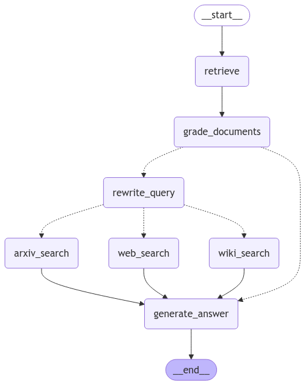

# Corrective RAG

A streamlined and modular Retrieval-Augmented Generation (RAG) system leveraging a corrective mechanism to optimize responses by verifying context relevance and utilizing external knowledge sources when needed.

## Features

1. **Relevance Checking:**
   - The system first utilizes a database retriever to verify whether the retrieved context is relevant to the user query.
   - If the context is relevant, the response is generated using the QA RAG chain.
   - If not, the system proceeds to rewrite the query and searches external sources.

2. **Query Rewriting:**
   - Rewrites user queries for better semantic understanding and optimization for external search engines.

3. **External Knowledge Integration:**
   - Searches external sources such as Wikipedia, web search (DuckDuckGo), or Arxiv for relevant context when database retriever fails to provide relevant information.

4. **Flexible Modular Design:**
   - Highly modular, allowing easy integration of new retrievers or knowledge sources.

## Components

### 1. Retriever
- **Database Retriever:**
  - Loads documents either from local or web-based sources (e.g., Wikipedia or web content).
  - Splits documents into smaller chunks and creates a FAISS-based vectorstore for similarity-based retrieval.
  
- **External Search Tools:**
  - Utilizes DuckDuckGo, Wikipedia, and Arxiv for retrieving relevant external information.

### 2. Query Rewriter
- Rephrases queries to enhance semantic intent and improve search effectiveness.

### 3. QA RAG Chain
- Generates detailed answers based on retrieved and validated context.
- Ensures responses are grounded in provided information and avoids hallucination.

### 4. Relevance Grader
- Assesses the relevance of retrieved context to the user query.
- Outputs a binary grade ("yes" or "no") to decide the next action (proceed with QA RAG chain or perform external search).

## Usage

### Installation

1. Clone the repository:
   ```bash
   git clone <repository-url>
   cd corrective_rag
   ```
2. Install the required dependencies:
   ```bash
   pip install -r requirements.txt
   ```

3. Set up environment variables:
   - Create a `.env` file in the root directory.
   - Add necessary API keys (e.g., `GROQ_API_KEY`, `TAVILY_API_KEY`).

### Running the System

1. Prepare the documents for the database retriever:
   - Either load Wikipedia data or web-based documents using the `Retriever` class.

2. Use the RAG pipeline to handle queries:
   - Queries are first checked for relevance using the `Relevance Grader`.
   - If relevant, generate responses using the QA RAG chain.
   - If not, rewrite the query and perform external searches.

3. Execute the pipeline:
   ```python
   from corrective_rag import RAG, Retriever, Grader, Tools

   # Initialize components
   retriever = Retriever()
   retriever.create_retriever()

   rag = RAG()
   qa_chain = rag.create_rag_chain()
   rewriter = rag.rephraser()

   grader = Grader()
   grader.create_grader()

   tools = Tools()
   wiki_tool = tools.wiki_search_tool()

   # Example usage
   query = "What are the benefits of a hip replacement surgery?"
   # Process query through the pipeline
   ```

## Folder Structure
```
corrective_rag/
├── corrective_rag.py      # Core RAG pipeline implementation
├── retriever.py           # Handles document retrieval and vectorstore creation
├── grader.py              # Relevance grading logic
├── tools.py               # External search tools (e.g., Wikipedia, Arxiv, web search)
├── requirements.txt       # Python dependencies
├── assets/                # Images and other assets
├── README.md              # Project documentation
```

## Workflow Diagram



## Dependencies
- LangChain
- DuckDuckGoSearchAPIWrapper
- FAISS
- Ollama Embeddings
- Python-dotenv

## Contributing

Contributions are welcome! Please create a pull request or open an issue for suggestions and improvements.

## License

This project is licensed under the MIT License.
